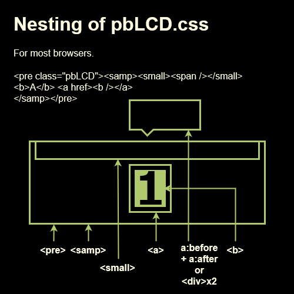
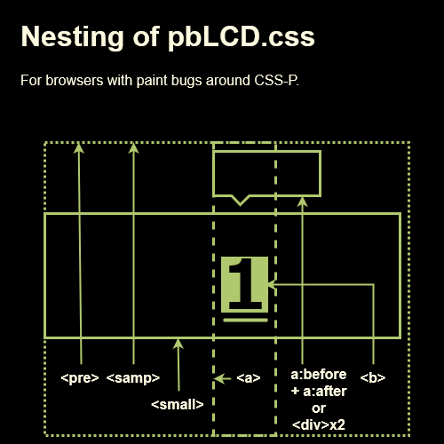

# pbLCD と pbChr

## はじめに

PB-100 のディスプレイを模した画像状のコンテンツ(pbLCD.css)と LCD セグメントを模した画像状のコンテンツ(pbChr.css)を HTML で提供できる。ブラウザが CSS に非対応の場合、テキストでコンテンツが提供される。

画像置換には `content:url` か `background-image` を使う。`content:url` は、印刷時に「背景画像を印刷しない」設定でもコンテンツが欠落しない利点がある。Opera 9.5, Gecko 1.9.1 未満の制限については [【画像スプライト編】Web文書のグレースフルデグラデーションをムキになってやってみる](https://outcloud.blogspot.com/2020/12/graceful-image-sprite.html) を参照のこと。

## 使用する技術とプロパティ

| browser      | pbChr           | pbChr blinking | pbLCD `<b>`    | `opacity`      | pbLCD ghost     | `opacity`      | 置換画像                 |
|:-------------|:----------------|:---------------|:---------------|:---------------|:----------------|:---------------|:-------------------------|
| modern       | :after content  | etc            | :after content | `opacity`      | :before content | `opacity`      | x3.gif, x3.anime.svg     |
| IE 9         | :after content  | motion gif     | :after content | `opacity`      | :before content | `opacity`      | x3.gif, x3.svg           |
| IE 8         | :after content  | motion gif     | :after content | alpha.png      | :before content | alpha.png      | x3_x10.png, x3_csr.gif   |
| Opera 9~9.2x | bg-img          | motion gif     | :after content | `opacity`      | :before content | `opacity`      | x3.gif                   |
| Opera 7.2~8  | bg-img          | motion gif     | :after content | alpha.png      | :before content | alpha.png      | x3_x10.png, x3_csr.gif   |
| Opera 7~7.1  | bg-img          | js             | bg-img         | alpha.png      | js              | alpha.png      | x3_x10.png               |
| Gecko ~1.9.0 | bg-img          | motion gif     | bg-img         | `-moz-opacity` | js              | `-moz-opacity` | x3.gif                   |
| IE 7         | bg-img          | motion gif     | bg-img         | alpha.png      | js              | alpha.png      | x3_x10.png, x3_csr.gif   |
| IE 5~6       | bg-img          | motion gif     | bg-img         | etc            | js              | etc            | x3_x10_8.png, x3_csr.gif |
| MacIE 5      | bg-img          | motion gif     | bg-img         | alpha.png      | js              | alpha.png      | x3_x10.png, x3_csr.gif   |

各ブラウザ用に異なる CSS プロパティを使って表示している。

## モダンブラウザと IE9

CSS Generated Content と CSS-P をインライン要素にも使える上に、`opacity` をサポートする為、最も短く記述出来る。実行時にロードする画像も最小サイズになる。

### EdgeHTML

[高圧縮されたアニメーション GIF でリピートしない](https://twitter.com/pbrocky/status/1510183308973412352)為、カーソルの点滅に [CSS アニメーションを使う](https://twitter.com/pbrocky/status/1513023402600443905)。

### モダンブラウと IE9 の強制カラーモード

テキストカラーを反映させるために pbChr では [x3.animate.svg でキャラクタを表示](https://twitter.com/pbrocky/status/1510137197621833731)する。カーソルの点滅は CSS で行う。

CSS アニメーションに対応しない IE9 は x3.svg を使い、Javascript でカーソルを点滅させる。

## IE8

CSS Generated Content と CSS-P をインライン要素にも使えるが `opacity` に対応しない為、複数の透過画像を並べた png をロードする。透過度の変化の為に `top` を変化させる。

### IE8 の強制カラーモード

light-on-dark, dark-on-light を Javascript で検出し、light-on-dark の場合は outline を使って色を反転させてカラーモードに馴染ませる。

## Opera 9~9.2x

CSS Generated Content と CSS-P を併せて使えるのはブロック要素限定という制限がある。この為にインライン要素の pbChr では `background-image` で表示する。

このバージョンから `opacity` をサポートした。

## Opera 7.2~8.x

CSS Generated Content と CSS-P を併せて使えるのはブロック要素限定という制限がある。この為にインライン要素の pbChr では `background-image` で表示する。

`opacity` をサポートしない為、複数の透過画像を並べた png を使用する。透過度の変化の為に `top` を変化させる。

## Opera 7.0~7.1

CSS Generated Content が CSS-P に非対応の為、ゴーストとツールチップの代替要素を javascript で書きだす。
`opacity` をサポートしない為、複数の透過画像を並べた png を使用する。透過度の変化の為の `background-position` は javascript で指定する。背景画像のモーション gif に非対応の為、js で点滅させる。

## Gecko ~1.9.0

1.9.0 は Firefox 3 にあたる。CSS Generated Content が CSS-P に非対応の為、ゴーストとツールチップの代替要素を javascript で書きだす。

かなり初期から `-moz-opacity` が使える。

Gecko 0.9.1, このバージョンだけ透過 png の透明色が黒くなる為、透過 gif に切り替えている。この切り替えで解消しない時もある。(pre.pbLCD>samp>small>span)

Gecko 1.1, このバージョンだけ、`-moz-opacity` が設定されている b 要素が a 要素の下に無いと、非表示になる。

### IE7

CSS Generated Content に非対応の為、ゴーストとツールチップの代替要素を javascript で書きだす。
透過 png に対応する。`background-position-x`, `background-position-y` が使える為、CSS を短く記述できる。
`background-image` で表示する為、背景画像を印字しない設定でコンテンツが欠落する。

## IE 5, 5.5, 6

IE7 の制限に加えて、透過 png に非対応の為、代替画像を使用する。`-ms-filter` が有効な場合、完全な透過表示を行う。

## Mac IE 5

> 続けて記述された複数のクラスセレクタ（E.class1.class2）

に非対応! 9個の png によるフォールバックの復活 [付録：CSS対応状況表 セレクタ](http://hp.vector.co.jp/authors/VA022006/css/corrbrwser/selector.html)

## pbLCD.css の入れ子

[Edit on draw.io](https://viewer.diagrams.net/?tags=%7B%7D&highlight=0000ff&edit=_blank&layers=1&nav=1&title=Nesting-of-pbLCD.drawio#R7VrbkqM2EP0aP65LIHPx49hjJ6lKtnZrUsnOowyyYQcjAvKMna9PCxAXIYMn48ts7fjBhVpSI3UfHXVLjPB8u%2F8lJUnwB%2FNpNDKRvx%2Fh%2B5FpuhME%2F0JwKATOtBRs0tAvREYteAj%2FpaVQNtuFPs1aDTljEQ%2BTttBjcUw93pKRNGUv7WZrFrXfmpAN7QgePBJ1pX%2BHPg8KqYVQLf%2BVhpuAKxUr4j1tUraLy9eNTIzyX1G9JVJVKcgC4rOXhggvRnieMsaLp%2B1%2BTiNhWWm1ot%2FySG017JTG%2FJQO9uPXv4zEtc2vv31eesz9bgezT3ah5ZlEOyqnkQ%2BWH6R98ilSoQSN8OwlCDl9SIgnal8AECAL%2BDaCkgGP6zCK5ixiKZRjFkOjWcZT9lSZFlcS2QzsNkNz116I7izmDflysbxbiLeWo6Qpp%2Fuj0zcqowJUKdtSnh6gyV76rehRotSUsH2pfT6Rvgsa%2FjZkQ1LibFOpro0ND6W9X2F758y27xr6qDeubPtqDUjju13jOxrbu5cyvWFe1fZgzhXyXPt2DsCKA6ZdB1gaB9gXcwAedgCN%2FTvB71DyIpJlode2edtBbQ%2BALWZgm%2FTwTVSPDYSl4FH0HiPkSMH9vtRQlA7N0heahjBhmpbCiKxoNKuIv%2BEt08W24b7Bv9TvbFOKd2FfJOmG8h6z2noUDHhZylIaER4%2Bt4ehc335hi8shAFWIJsaLYxNDAU8GdulHi07NTcqRU9FBaUirKKwMENHUQ7EatZvwOZEg02bbMWSj8BksySllWDDKw82oAsrlesIQiFjDT%2BTKNzEAvHgewG7mVj3IUQrd2XFNvR98RotI7WXhABcGW8ZtiyXgzQuSzg20mOhgURbg0R8Mb6xrso3ptWimwGquSmr3IotDOsIRF5LF6oirEYNl6YLXQzdpItMPH%2FwRS9fGOY7Iww5hUsSxk%2B57k3bOlOYoCi6dpggAXF03ZOPRT%2BUlRyBws0W%2FXWzEsdpZSUggNDzR8tKbsUj%2BNiO8VoeAUVjhFu6TGM6nrqo%2FpnXZRZtApJzih8%2Bw%2BOmoBd8t6JrJpIRmPpMjA9EZC2AUTaH1zd6aJSwqukqbTRrsFjRuMFje1PbRfu%2BD8ZrMx5GCmjNLuM5ztjqrpqLncSYZ8%2BMVPtqOHAf8oICrbL0KPkNnmvqE4V3kSSBNXI26bPjTc9eJiqw0P%2BNqmr4ybjKPC2uAoSQQ6NZIhpkpw8Zt%2B8v4KHQeF5qHUrWVh9B2wCFOe8tUzv3PUo%2Ff72nexXllE13p1WdhlzHF%2B5VA2jDctsB9NS%2B2rF%2BdaHzowbQJlLO6ycQBytaTt41kIihp%2FXPbgPTuXJqPh1g%2BWxLhJYPpu89k1OZvgGQW5E91h3LFblHYMi84zPNeBhvoBlbixmvfp%2Ffj70s681b6u5SmEjBUmRJaMsygfiV%2BOKEptn4uLZjqVR%2Bb4Ry0suHbv%2BzY7lcDLAuqrgcOkseBHarQULiPF9c9rWCar2m3vkpsdNdR2cnuEKdEzMUpHTdN7TVSaPvnL31j1zMd8Cy0ERz79cDqGR0%2FjQYvOcJZON7qy79yWBA95%2FMY6ENAxZYR%2FmGGwDx0PgkkrkYqSjphSZ8nNimLgU21F3kfKyiOcpdLEez%2BUjeab%2FnfcFxh%2FeF8su0M33NoySIyLrxpnDCsW0WkEQ8grUjtuPDWUDSiBHLTo2wUY1Snyj3goZrdKbvSRFO%2BWouYVnIQxabo%2BqGOSvXLGpUF4Gxcy5Xt0OAagk2XF1d3b3xuAqK9ceQRSRYf2%2BKF%2F8B)

### CSS-Pに関連するペイントのバグ

[Gecko ~1.2.1 には CSS-P している要素が親要素をはみ出す部分について、onload 時に当該要素が ViewPort 外の場合にペイントされない不具合がある。テキスト選択などで描画される。スクロールで ViewPort 外に出た後に再び ViewPort に入ると描画されていない場合も。回避の為に入れ子を工夫する。](https://twitter.com/pbrocky/status/1515533691807752195)

[Edit on draw.io](https://viewer.diagrams.net/?tags=%7B%7D&highlight=0000ff&edit=_blank&layers=1&nav=1&title=Nesting-of-pbLCD-with-paint-bugs.drawio#R7VpZj6s2FP41eZzI2ATI45ClrdRezdVUbe%2BjAw7QIRgZZ5L019cGszvL5GaZkZKHCB%2FvZ%2Fn8HcMATVbbXxhOwz%2BoT%2BIBBP52gKYDCB0TiH8p2BUCe6wEAYv8QmTUgtfoP6KEZbN15JOs1ZBTGvMobQs9miTE4y0ZZoxu2s2WNG7PmuKA9ASvHo770r8jn4eFdARALf%2BVREHIOxUL7L0FjK4TNd0AIpD%2FiuoVLodSgizEPt00RGg2QBNGKS%2BeVtsJiaVmS60V%2FeZ7aqtlM5LwUzpYP77%2FZaSOBb%2F%2F9m3uUedfK3SfkFkM847jNSn3ka%2BW70oF5XskchQwQO4mjDh5TbEnazfCI4Qs5KtYlAzxuIzieEJjykQ5oYlo5Gac0bdKt6iSlM2E4lwwcayZ7E4T3pDPZ%2FPnmZzVx1mYL8FQhRfMOWFJLoFAStVGCONku1dFRqV44c6ErghnO9FkW9q26KE82bBUeVP7hVm6bdjwCYSUECtfDKqha4OIB2WTD9jH%2BhrmubzuoanRPdDo3jCvpXv7wrrvK3qvNc4OjQsYotL8gSiwbxoEBrypJYRyF8BzrPPMcQkLdGNh3LfASGMB62oGQMcNQBL%2FWZ7GouTFOMsir63ztoHaFhC6cIVu2O4fWT0EY1QKfqj2eWG6bZV2zdILYZHYLGFKGOMFid3qiG5YCjrIMpyfsC3xe4SiY1nBYDALCD%2Bg0uLg7bvAEROXMkZizKP39jp0dlczvNBIrLDysLHRcrDqUCtHyOiaeUR1anKKzjgVEKiBUNcFCz30Bsq9sNr1Tzimjr5YeCXjPRYqc1NGKkHAKxM2%2FFaEKdehQweXNVCN4yiQBMQTxpd%2B58qgjwSxfFYVq8j35TRaOGrHg%2FQ4RY0NqyyrRRrXRRsL6H2h4YmWDu6vBjaj64PNXdHhXkFvjPZY%2BqNR3x3IuHXU61hxM%2Boz%2BfwI%2B4Nhb8BPFvflFh5xf%2BG47yE8tM487c0jA1057kuH2Bv3%2BBH0H8ssRNAPgXHnuL9tcmHb7eRiaAsS%2BdUSjHtBCeoiwLkUQgw0BKg1FjTGw7ED6h%2B8LbhoU4kcVvzoXTwGBcKg5wVZUplWiK27cn1ChJfSMVRzMX2jh2YQWjVdsEazBpAVjRtQtoXaLtr5HqDXBj3UZTqwz3RsezjqR83VLlTgxXOcrn41GLiNeAGBI1WqLlfEcw19slAi351vUQo0OaRH655oaHYdC5yJhnBcud%2Bu47NH0E94CN41mqWyQXb6klH7pZF4KEa8LLQey9cWD952BMLGny1Zc65P2s4Bn%2Bri%2FqsyLAg6V7NmzdA%2FDCugE%2BzObe9pkCZfm80H7mRQ3j9%2F5hi3neMxrl74X%2Bi9W%2BcIAKP7xjg6ITHLQpzKR6HtmK75Hh03jJo20ijVqZFZdTHhjXAvbJhGp%2FoDBOSUl90pzSIe0QTm1AhKbpQpkAeN6rzWsC9l6s4Fqt2H8%2Bp%2B7iaEFOku34r0IjTK1OIbyXiUBKIZXcr9Ln6fTIdelh1MTerupTAtBXOZCIGF%2FISHsCzfvti9VGQBY4t1IKW4%2BMgGgsnr69PL8OBs6RXSoEw4s9w2mo7q0p9UOPb0Ce5720yFgyzj%2FPALBfyQ5CQ6ca273i691NAH04K6FMjoZviXoxDjI6wwW2E5yoMZHjZthxma97%2FRQzrL7ieHyiBaZmicfQrUTLD9aYc7sSY5yntr9r6HfZpfgSiO2kSx9%2Br95Ks4cGSgs1miKNafNxbN6y9I0ex%2F)